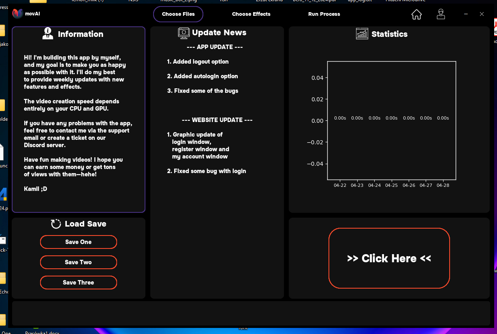
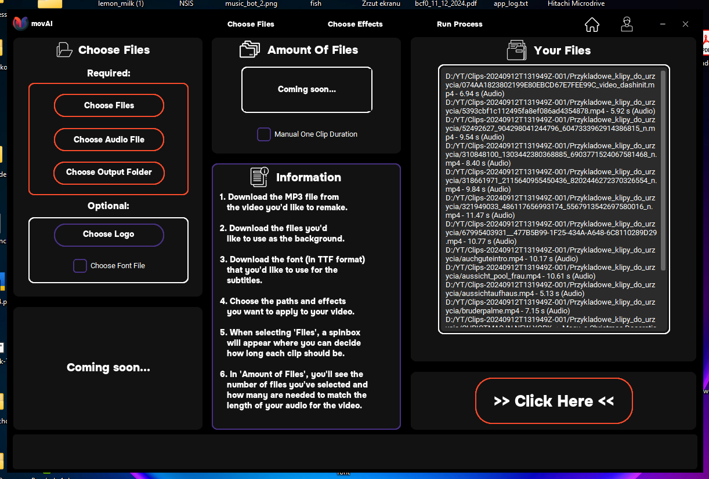
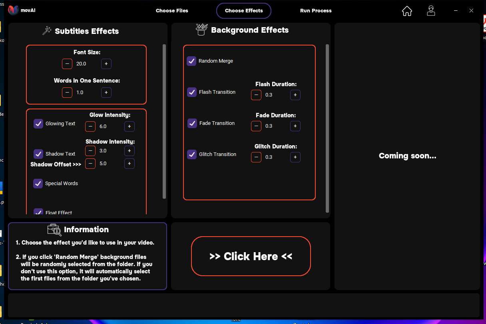
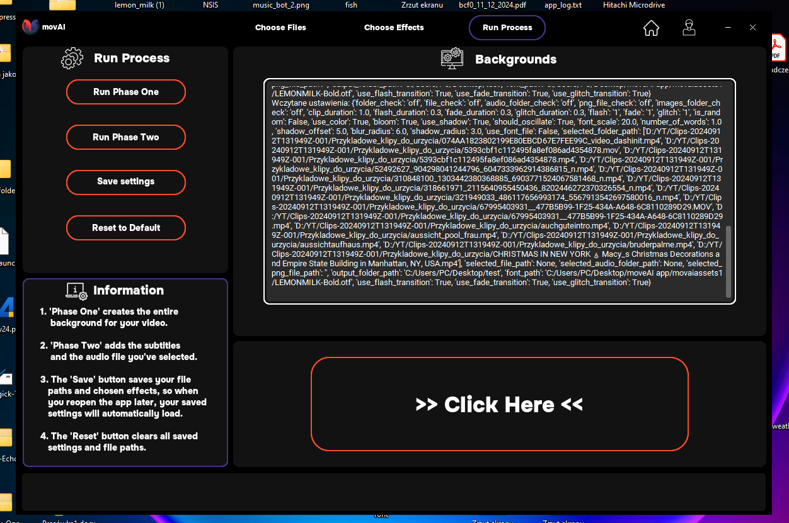
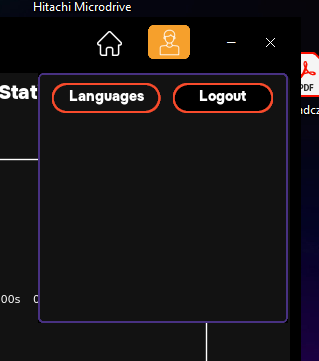
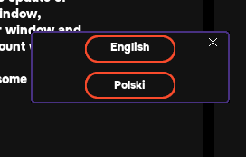
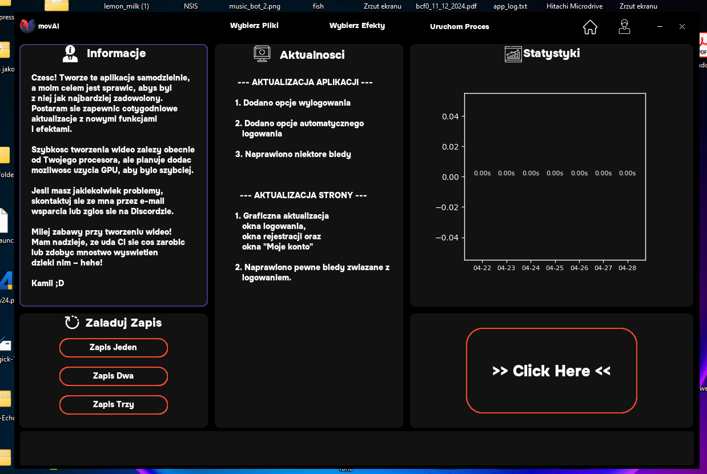

# movAI

Welcome to the repository for **movAI** — an advanced tool designed to automatically edit short videos, Reels, and TikToks with ease. Please note that the files in this repository are for *preview purposes only*. To use the full application, you must download the installer from [this link](#).

## Features

- ✨ **Automatic Subtitles**: Generate captions automatically and style them with effects like the popular glowing text.
- ✂️ **Auto Trimming**: Automatically cuts video and audio clips to match the perfect timing.
- 🎉 **Popular Effects**: Includes trendy visual effects such as text glow and more.
- 🌐 **Multi-language Support**: Available in **English** and **Polish**.
- 📊 **Post-editing Statistics**: Displays detailed statistics after creating a video.
- 📚 **Live Background Process Display**: Shows real-time logs and process prints during editing.
- 🔄 **Settings Save Functionality**: Save your preferences to avoid reconfiguring options every time.

## Important

- The files located in this repository are **for preview only**.
- Due to the size of the necessary assets and dependencies, the full program must be installed via the provided installer.

## Screenshots

Here are some previews from movAI:

## About

This is my **biggest project so far**, and I am proud to announce that a **new version** — featuring massive performance improvements, no lags, and 100x better overall functionality — is currently **on the way**!

## Disclaimer

Please note that the current version of movAI might experience occasional minor lags. If you encounter any issues during installation or while using the program, feel free to contact me for support.

